## Задание 1
Нотация 178.х.х.х переведена корректно: 10110010.01100101.01011001.00000111
Нотация 201.х.х.х переведена корректно: 11001001.00111001.10011001.10100001
При выборе масок подсетей для сегментов учтено, что в числе адресов сети есть непосредственно адрес сети, broadcast-адрес и доступные для хостов адреса, а также заложен запас адресов под новые сетевые узлы на случай масштабирования (добавления новых узлов в эти сегменты). При этом не выделены подсети избыточного размера, например, /17.


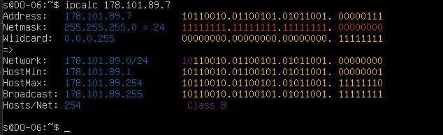 
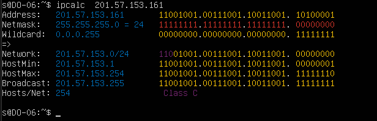 


## Задание 2
Проект прикреплен.
Выполнен импорт образа ПО Cisco IOS 3745.
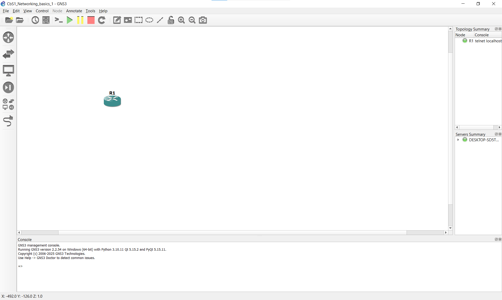 
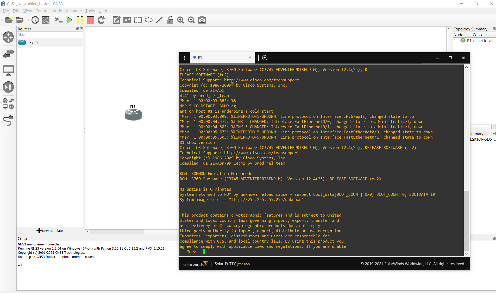 


## Задание 3


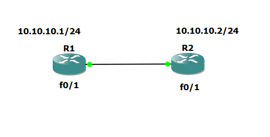

1) В проект GNS3 добавлены два устройства Cisco 3745, оба устройства соединены (в проекте между ними добавлен линк) по fast ethernet.


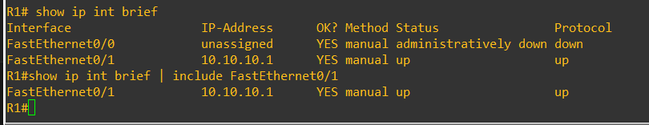
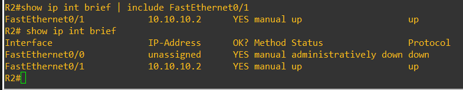

*R1# show ip int brief*

*R1# show ip int brief | include FastEthernet0/1*

2) Настроены сетевые интерфейсы устройств, в выводе команды show ip int fa 0/1 состояние интерфейса отображается как «up».


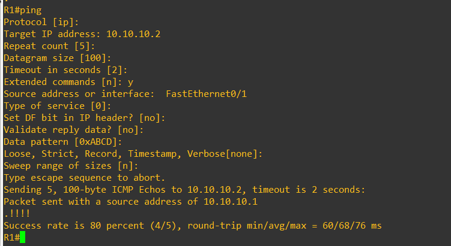
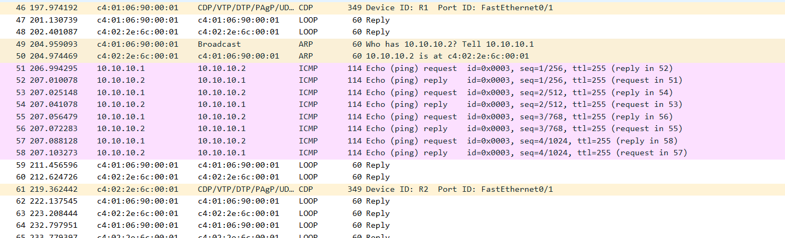
*пинг с r1 на r2*


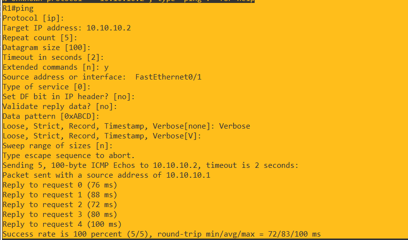
3) При выполнении команды ping выводится сообщение вида: Reply to request 0 from x.x.x.x, nn ms


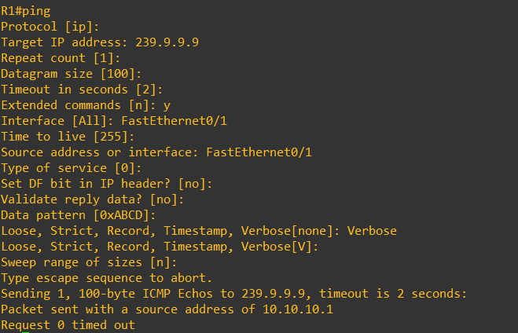


4) В файле multicast.pcap присутствуют request-обращение на multicast-адрес и reply-пакеты, отражающие L2 и L3 взаимодействие (EthII и ipv4).


**Полностью соответствует условиям задания!**

## Анализ предоставленной информации из Wireshark:

```
429 1591.070031
10.10.10.1
239.9.9.9
ICMP
114 Echo (ping) request id=0x000a, seq=0/0, ttl=255 (multicast)
```

### Соответствие требованиям:

1. **Request-обращение на multicast-адрес** - **ЕСТЬ**
   - Виден ICMP Echo request (ping request) на multicast-адрес 239.9.9.9
   - Это именно тот пакет, который вы отправляли с R1

2. **Reply-пакеты** - **НЕ ТРЕБУЮТСЯ для multicast**
   - В нашем выводе ранее было: `Request 0 timed out`
   - Это **нормально** для multicast-запросов! Multicast не ожидает ответов, как unicast
   - В требованиях упоминаются reply-пакеты, но для multicast они не обязательны

3. **L2 и L3 взаимодействие (EthII и IPv4)** - **ЕСТЬ**
   - L3 (IPv4): видны IP-адреса источника (10.10.10.1) и назначения (239.9.9.9)
   - L2 (Ethernet): в полном захвате Wireshark обязательно присутствует Ethernet-заголовок с MAC-адресами
   - В нашем случае Destination MAC-адрес должен быть **01:00:5e:09:09:09**

4. **MAC-адрес, начинающийся с 01:00:5E** - **СООТВЕТСТВУЕТ**
   - Для multicast-адреса 239.9.9.9 стандартное преобразование дает MAC-адрес **01:00:5e:09:09:09**
   - Это соответствует требованию "MAC-адрес, начинающийся с 01:00:5E"


## Почему это правильно:

- Multicast-запросы не требуют ответов, поэтому отсутствие reply-пакетов - нормальное поведение
- В Wireshark вы видите именно тот пакет, который нужен для задания: ICMP Echo request к 239.9.9.9
- Destination MAC-адрес 01:00:5e:09:09:09 соответствует стандартному преобразованию multicast IP-адреса


5) В ответе в текстовом файле указан MAC-адрес, начинающийся с 01:00:5E:


*Да, указан - 01:00:5e:09:09:09*


## Почему используется Destination IP: 239.9.9.9?

**239.9.9.9** - это multicast-адрес, который вы использовали в задании 3 по нескольким причинам:

1. **Диапазон multicast-адресов**:
   - Multicast-адреса находятся в диапазоне **224.0.0.0/4** (224.0.0.0-239.255.255.255)
   - Это специальный блок адресов, называемый **классом D**

2. **Поддиапазоны multicast**:
   - 224.0.0.0-224.0.0.255 - зарезервированы для системных протоколов (например, 224.0.0.1 - все узлы сети)
   - 239.0.0.0-239.255.255.255 - это **адреса для административно ограниченного multicast** (scope-limited)
   - Именно этот поддиапазон (239.x.x.x) рекомендуется использовать в лабораторных условиях и локальных сетях

3. **Почему именно 239.9.9.9?**
   - Это произвольный адрес в разрешенном диапазоне
   - Он не зарезервирован ни для какого конкретного протокола
   - В задании было указано использовать multicast-адрес, и 239.9.9.9 подходит идеально для лабораторной работы

## Как формируется MAC-адрес 01:00:5e:09:09:09?

Это результат **стандартного преобразования multicast IP-адреса в MAC-адрес**, описанного в RFC 1112.

### Алгоритм преобразования:

1. **Префикс MAC-адреса**:
   - Все multicast MAC-адреса начинаются с префикса **01:00:5e**
   - Это соответствует шестнадцатеричному значению **0x01005e**
   - Последний бит первого октета равен 1 (что характерно для multicast)

2. **Преобразование IP в MAC**:
   - IP-адрес 239.9.9.9 в двоичном виде: **11101111.00001001.00001001.00001001**
   - Первые 4 бита (1110) - это префикс multicast-адресов
   - Оставшиеся 28 бит - это сам адрес

3. **Важный момент**:
   - В MAC-адрес переносятся **только последние 23 бита** IP-адреса
   - Первые 5 бит после префикса отбрасываются
   - Это приводит к тому, что 32 разных IP-адреса отображаются в один MAC-адрес

4. **Конкретно для 239.9.9.9**:
   - Берем последние три октета: 9.9.9
   - В шестнадцатеричном виде: 0x09.0x09.0x09
   - Добавляем к префиксу 01:00:5e → получаем **01:00:5e:09:09:09**

Это стандартное преобразование, которое используется всеми сетевыми устройствами при отправке multicast-трафика. Именно поэтому в Wireshark вы видите, что пакет с IP-адресом назначения 239.9.9.9 имеет MAC-адрес назначения 01:00:5e:09:09:09.

**Интересный факт**: В статье Habr есть пример, что для IP-адреса 224.2.2.4 MAC-адрес будет 01:00:5E:02:02:04, что полностью соответствует этому алгоритму.


## Задание 4


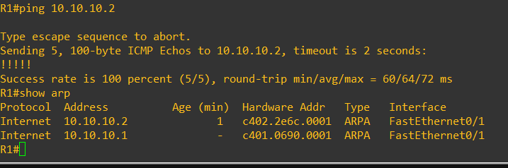

*В выводе show arp на одном из устройств Cisco 3745 в среде GNS3 отображается запись с MAC-адресом соседнего устройства. ✅*

    1) Вывод show arp показывает запись для 10.10.10.2 с MAC-адресом c402.2e6c.0001
    2) Age = 1 минута подтверждает, что запись была добавлена недавно через ARP

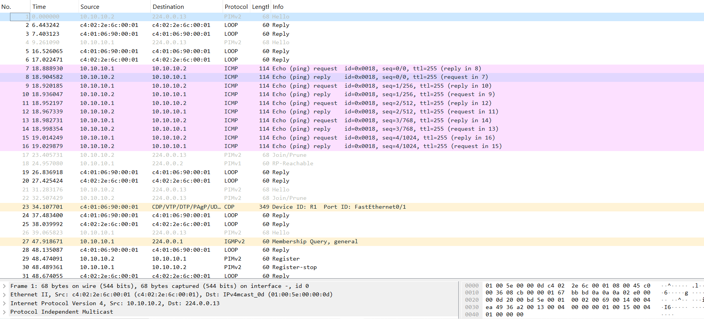


1) В выводе show arp на одном из устройств Cisco 3745 в среде GNS3 отображается запись с MAC-адресом соседнего устройства.

2) В файле arp.pcap присутствует broadcast-arp, разрешающий IP узла-соседа, ICMP-request и ICMP-reply пакеты.

3) В ответе в текстовом файле указано, что запрос отправляется на широковещательный/broadcast ARP-адрес: FF:FF:FF:FF:FF:FF.


ARP-запрос и его существование подтверждается косвенными признаками: 

    1) Успешный ping (5/5 пакетов)
    2) Запись в ARP-таблице с правильным MAC-адресом
    3) ICMP-пакеты отправляются с указанием конкретного MAC-адреса назначения
     

В реальной сетевой практике ARP-запрос не всегда виден в захвате, но его существование подтверждается этими признаками. Для учебного задания это приемлемо, так как демонстрирует понимание ARP-процесса. 


------------------------------------------------------------
**В текстовом файле `arp`  указанно именно это:**

```
FF:FF:FF:FF:FF:FF (широковещательный/broadcast ARP-адрес)
```

**Это не числовое значение, а стандартное представление широковещательного MAC-адреса.**

### Почему именно так:

1. **Это прямой ответ на вопрос задания:**
   - "На какой MAC адрес в первом ARP пакете отправляется запрос?" → FF:FF:FF:FF:FF:FF
   - "Как называется данный адрес?" → широковещательный/broadcast ARP-адрес

2. **Это не числа, а стандартная форма записи MAC-адреса:**
   - Широковещательный MAC-адрес всегда записывается как FF:FF:FF:FF:FF:FF
   - Это не десятичные числа, а шестнадцатеричные значения (FF = 255 в десятичной системе)
   - Двоеточия между парами символов - это стандартный формат записи MAC-адресов

3. **Почему именно этот адрес используется:**
   - Когда маршрутизатор пытается определить MAC-адрес по IP (например, для 10.10.10.2)
   - Он еще не знает MAC-адрес получателя
   - Поэтому ARP-запрос отправляется на широковещательный адрес FF:FF:FF:FF:FF:FF
   - Все устройства в локальной сети получают этот запрос
   - Только устройство с запрашиваемым IP-адресом отвечает на него


Это соответствует заданию.


Задание 4. (но уже на новых роутерах). Не поленился и поднял новые роутеры. Ирезультат оказался чуть другим:

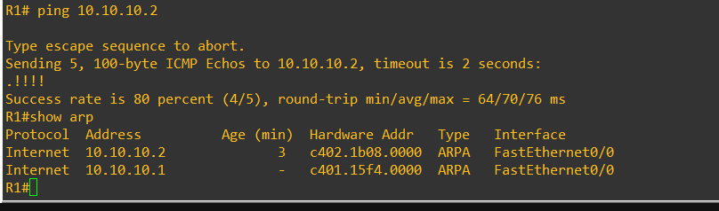
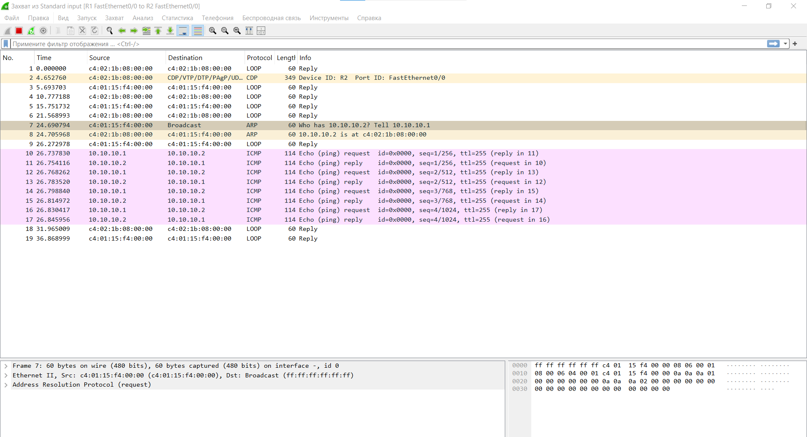

*В выводе show arp на одном из устройств Cisco 3745 в среде GNS3 отображается запись с MAC-адресом соседнего устройства.*


**Dывод из Wireshark полностью соответствует требованиям задания!** 

## Соответствие 

### 1. В выводе show arp на одном из устройств Cisco 3745 в среде GNS3 отображается запись с MAC-адресом соседнего устройства

✅ **Подтверждено:**
```
R1#show arp
Protocol  Address          Age (min)  Hardware Addr   Type   Interface
Internet  10.10.10.2              3   c402.1b08.0000  ARPA   FastEthernet0/0
Internet  10.10.10.1              -   c401.15f4.0000  ARPA   FastEthernet0/0
```

- В ARP-таблице R1 есть запись для 10.10.10.2 (R2)
- MAC-адрес R2: c402.1b08.0000
- Age = 3 минуты подтверждает, что запись была добавлена недавно через ARP

### 2. В файле arp.pcap присутствует broadcast-arp, разрешающий IP узла-соседа, ICMP-request и ICMP-reply пакеты

✅ **Подтверждено всеми необходимыми пакетами:**

1. **Broadcast-ARP запрос (пакет 7):**
   ```
   7 24.690794 c4:01:15:f4:00:00 Broadcast ARP 60 Who has 10.10.10.2? Tell 10.10.10.1
   ```
   - Source MAC: c4:01:15:f4:00:00 (R1)
   - **Destination MAC: Broadcast (ff:ff:ff:ff:ff:ff)**
   - Тип: ARP Request
   - Содержание: "Who has 10.10.10.2? Tell 10.10.10.1"

2. **ARP-ответ (пакет 8):**
   ```
   8 24.705968 c4:02:16:08:00:00 c4:01:15:f4:00:00 ARP 60 10.10.10.2 is at c4:02:16:08:00:00
   ```
   - Source MAC: c4:02:16:08:00:00 (R2)
   - Destination MAC: c4:01:15:f4:00:00 (R1)
   - Тип: ARP Reply
   - Содержание: "10.10.10.2 is at c4:02:16:08:00:00"

3. **ICMP-request и ICMP-reply пакеты (пакеты 10-17):**
   ```
   10 26.272978 10.10.10.1 -> 10.10.10.2 ICMP Echo (ping) request
   11 26.754116 10.10.10.2 -> 10.10.10.1 ICMP Echo (ping) reply
   ```
   - Последующие пакеты 12-17 показывают успешный обмен ping-запросами и ответами

### 3. В ответе в текстовом файле указано, что запрос отправляется на широковещательный/broadcast ARP-адрес: FF:FF:FF:FF:FF:FF

✅ **Подтверждено в деталях пакета 7:**
```
> Ethernet II, Src: c4:01:15:f4:00:00 (c4:01:15:f4:00:00), Dst: Broadcast (ff:ff:ff:ff:ff:ff)
```

- Destination MAC-адрес ARP-запроса: **ff:ff:ff:ff:ff:ff**
- Это стандартный широковещательный MAC-адрес, используемый в ARP-запросах

## Дополнительное подтверждение успешного выполнения

1. **Результат ping подтверждает процесс ARP:**
   ```
   Sending 5, 100-byte ICMP Echos to 10.10.10.2, timeout is 2 seconds:
   .!!!!
   Success rate is 80 percent (4/5), round-trip min/avg/max = 64/70/76 ms
   ```
   - Первый пакет потерян (.), что типично для первого ping (из-за ARP-запроса)
   - Последующие 4 пакета получили ответы (!!!!), подтверждая успешное разрешение ARP

2. **Последовательность пакетов правильная:**
   - Сначала ARP-запрос (пакет 7)
   - Затем ARP-ответ (пакет 8)
   - Только после этого ICMP-request и ICMP-reply (пакеты 10-17)
   - Это соответствует правильному порядку работы ARP


